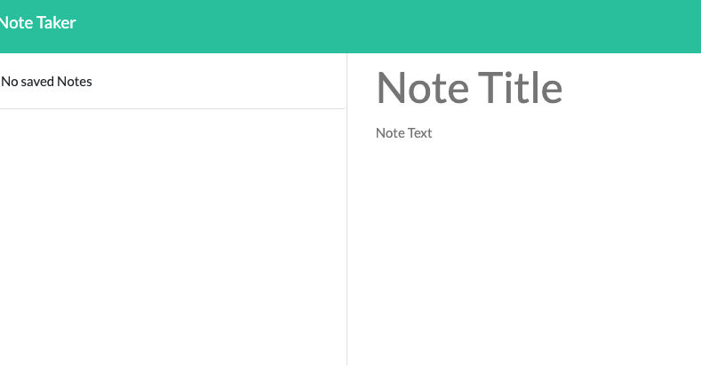
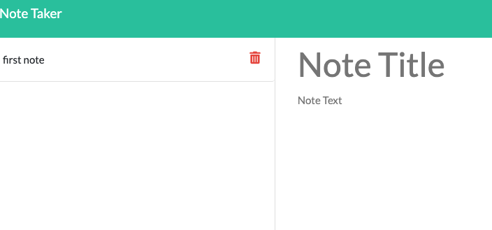
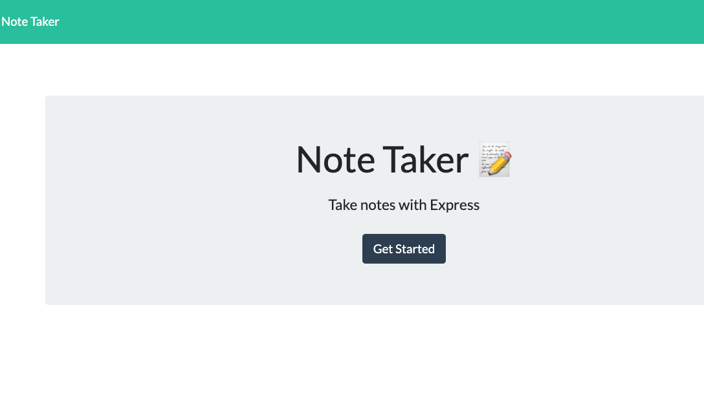

# express_note_taker

## Description
The purpose if this assignment is to modify starter code to create an application that allow a user to write and save notes. 

link to github repo:
https://github.com/jcorcorangithub/express_note_taker

link to application:
https://gentle-beyond-36422.herokuapp.com/

## Technologies
JavaScript
HTMl
CSS
Node.js
Express.js

## Contributors
I will be the sole contributor of this project 

## Contact
Name: James Corcoran 
email: jpcsoccer1234@gmail.com

